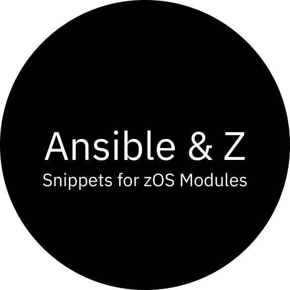

# Ansible and Z - Snippets for zOS Modules

 

This extension has a set of snippets to help you write your ansible playbooks for Z.

All snippets are prepared for YAML files, since the structure, with a base header and vars definition:

 

To access the snippets available you can press `Ctrl+Space` and type zOS, it will show you all zOS Modules snippets available. Together with them we have `DD` snippets for `zos_mvs_raw`:

 

If the snippets doesn't load after install, try to reload your VS Code.